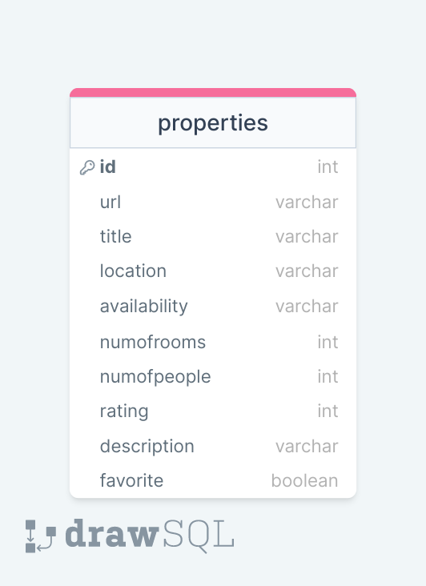
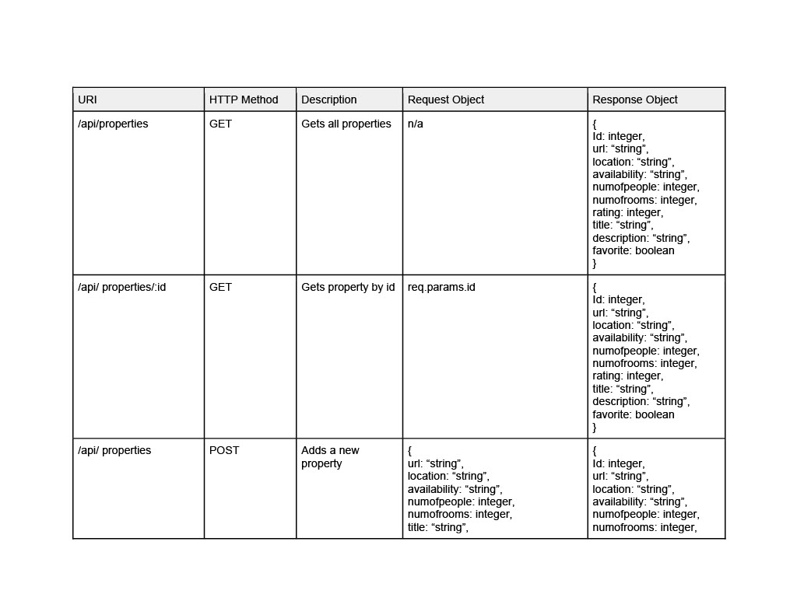
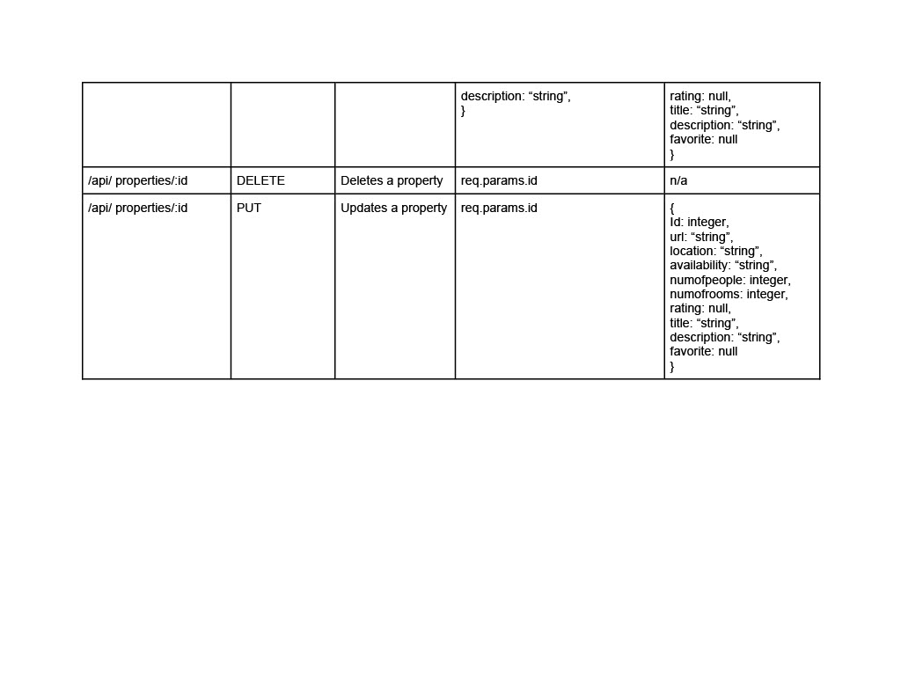

# Full Stack House Swap App

## Introduction

House Swap is an app for people who want to temporarily exchange their home with another person. It's a low-cost option for people to travel and stay at a local's home.

 

## Features & Views
The app has has the following views: Home - Single House - Favorites - My Home.

The app simulates the different views that an annonymous and a logged in user would have. 

 
<b>Home</b>

In the home view, you can see the listing of all properties. All users can see basic information for each house. Logged in users would also have access to contact information and would be able to mark a property as favorite.

 
<b>Single House</b>

Each house has a view of its own with additional description left by the owner.

 
<b>Favorites</b>

Once a logged in user has marked a house as favorite, it would appear in the list in the favorite section. It can also be removed from the selection.

 
<b>My Home</b>

Logged in users would have an option to create their own post, which would be added to the main listing on the Home View. Once posted, they can edit or delete it. 

 

## Technologies

The app was build using HTML, CSS, Bootstrap, JavaScript, React, Node.js, Express, MySQL.

 

## Installation

1. Create a .env file:

DB_HOST=localhost
DB_NAME=houseswap
DB_USER=root
DB_PASS=YOUR_PASSWORD

(replace 'YOUR_PASSWORD' with your actual password)

2. To create the database, go to your MySql terminal and type:

CREATE DATABASE houseswap;

3. To run the database, go to the server side in your terminal and type:

npm run migrate

4. While on the server side, install all NPM packages by typing:

npm install

5. to run the backend, type:

npm start

6. Cd into the client side and repeat step 4 and 5 here as well.

The backend runs on http://localhost:5000 and the frontend runs on http://localhost:3000.

 

## Database Schema
 
 

 

## API Routes
 

 
     

 

## Future Features
Some of the ideas for possible future features:

- log in option to separate anonymous and logged in users
- search function
- implement a rating system
- leave reviews for properties you stayed at
- implement a calendar for availability 
- show listings from people who are looking to stay in your area 
- message function for logged in users 
- show all properties on a map 
- being able to upload own images instead of using an url address

 

 _This is a student project that was created at [CodeOp](http://CodeOp.tech), a full stack development bootcamp in Barcelona._

  
